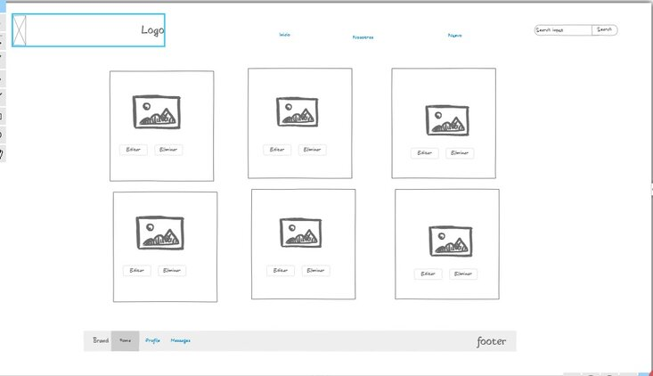
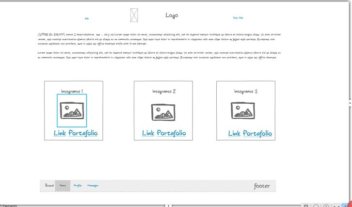
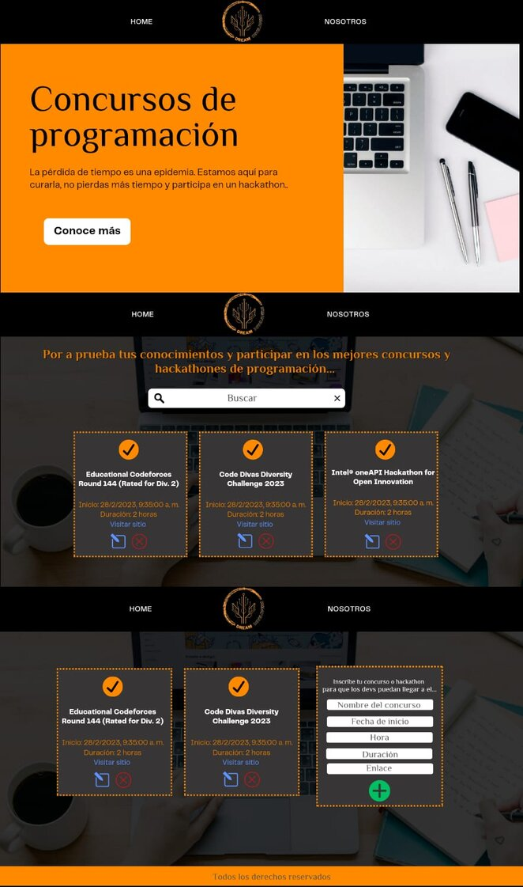
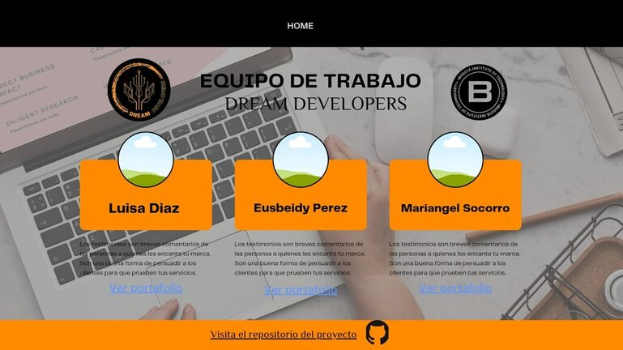
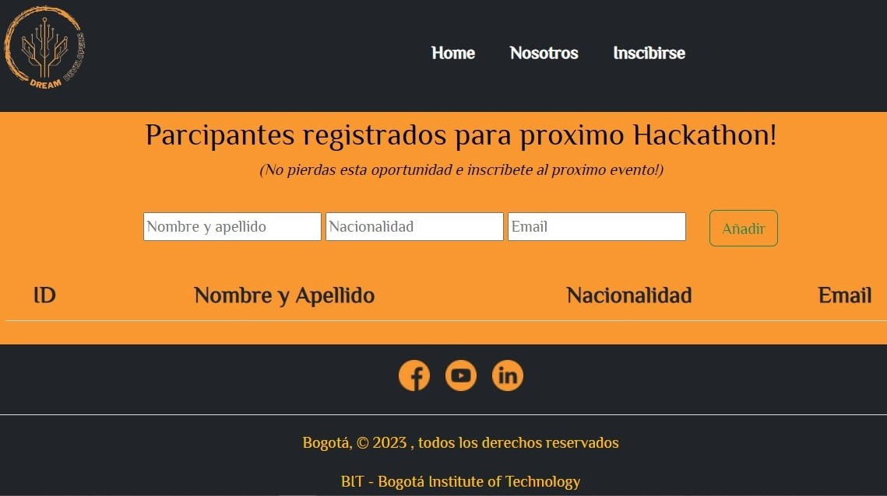
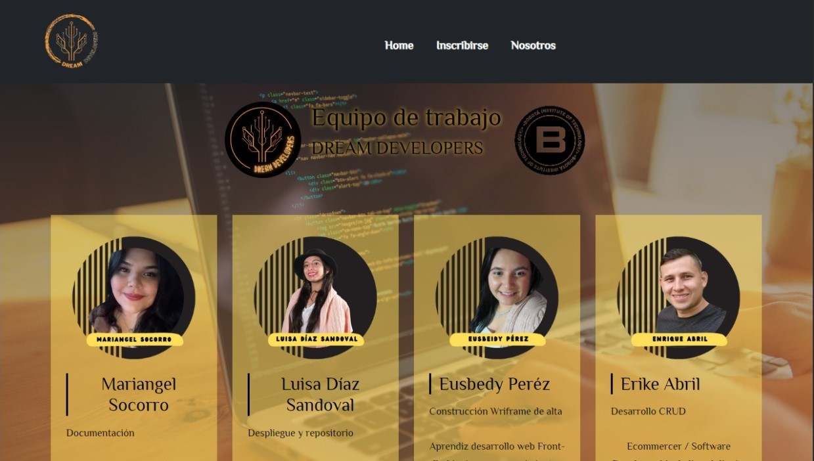
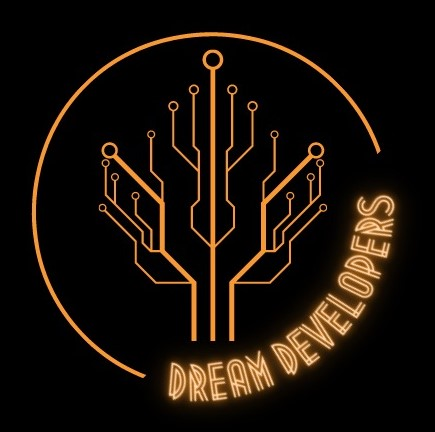

# Bit10team

##  Descripción :page_with_curl:

 En este repositorio encontrará el proyecto final del Bootcamp de programación frontend con especilización en Reac de BIT - Bogota Institute of Thecnology, el cual tiene como finalidad consumir un API que refleja información de concursos y hackathones de programación , en su sección de inicio de ve dicho requerimieto y se evidencia un filtro de búsqueda para esta, la segunda sección es un espacio de operaciones CRUD Create, Read, Update, Delete = **Crear, Leer, Actualizar y Eliminar** para una previa inscripción de participantes y en la última sección encontrá los autores del proyecto.   

## Tabla de contenido
1. [Delegados](#delegados)
2. [Ruta de estilos](#ruta-de-estilos)
3. [Horarios de trabajo](#horarios-de-trabajo)
4. [Instalación](#instalación)
5. [Tecnologías](#tecnologías)
6. [Team](#team)


<a name="delegados"></a>
##   Delegados 

- **Luisa Díaz Sandoval** -  Repositorio y despliegue del proyecto.
- **Mariangel Socorro** - Documentación. 
- **Eusbeidy Pérez** - Wireframe de alta.  
- **Enrique Abril** - Funcionamiento del CRUD. 

<a name="ruta-de-estilos"></a>
## Ruta de estilos 
- Fuentes Google Fonts: 
PHILOSOPHER, TILT NEON. 

- Paleta de colores: 
`#F99730`🟠
`#000000`⚫
`#FFDE59`🟡

- Wireframe de baja: 




- Wireframe de alta. 






- Logotipo del team:



<a name="horarios-de-trabajo"></a>
## Horarios de trabajo

Reuniones virtuales a través de google meet. 

|    Días       |   Horario     |
| ------------- | ------------- |
| Lunes         | 6:00 a 10:00pm|
| Martes        | 6:00 a 10:00pm|
| Miécoles      | 6:00 a 10:00pm|
| Jueves        | 6:00 a 10:00pm|
| viernes       | 6:00 a 10:00pm|
| Sábado        | 6:30 a 7:30pm |

<a name="instalación"></a>
## Instalación

_Asegurece que tenga instalado en su equipo npm para ello ejecute en la terminal el siguiente comando_
```
npm -v
```

_En el caso que ya cuente con este ejecute el comando a continuación,_ 
```
npm run dev
```
_de lo contario dirijase al siguiente_  [link](https://co.video.search.yahoo.com/search/video?fr=mcafee&ei=UTF-8&p=como+intalar+npm&type=E210CO91215G0#id=1&vid=e14ce88f632f4bcd22ceba395d2bb249&action=click)

<a name="tecnologías"></a>
## Tecnologías. 

1. Lenguajes de programación.
    - JavaScript

2. Lenguajes de marcado. 
    - HTML
    - CSS

3. Frameworks.
    - React
    - Bootstrap
    - Font Awesome
    - React Icons

4. Herramientas complementarias.
    - Trello 
    - Canva
    - Ninja Mock
    - Visual StudioCode
    - Meet
    
***

<a name="team"></a>
### Team 

 **DREAM DEVELOPERS** :gem:

- [Mariangel Socorro](https://www.linkedin.com/in/mariangelsocorro/)
- [Luisa Díaz Sandoval](https://www.linkedin.com/in/lufe-diaz-s/)
- [Eusbeidy Pérez](https://www.linkedin.com/in/eusbeidy-perez)
- [Enrique Abril](https://github.com/kiketach)


