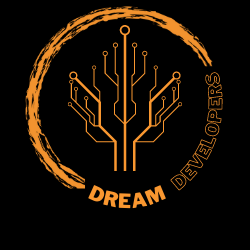

# Dreams Developers

## Descripción  :bookmark_tabs:

 Este es el proyecto final del Boocampt de programación frontend con especilización en Reac de BIT - Bogota Institute of Thecnology, el cual tiene como finalidad consumir un API que refleja información de concursos de programación y a la cual se le puede ejecutar los procesos de: **crear,leer,actulizar y eliminar** su contenido.  


### Delegados :busts_in_silhouette:
-  :dizzy: ***Luisa Díaz Sandoval***  :dizzy:  Repositorio y despliegue del proyecto 
-  :dizzy: ***Mariangel Socorro*** :dizzy: Documentación  
- :dizzy: ***Eusbeidy Pérez*** :dizzy:  Wireframe de alta  

### Tareas conjuntas
- Construcción Wirefame de baja -> Todo el equipo


### Construcción de ruta de estilos. 
- Fuentes PHILOSOPHER, TILT NEON.  Recurso: Google Fonts
- Designación de colores: 
`#F99730`:orange_circle:
`#000000`:black_circle:
`#FFDE59`:yellow_circle:

- Wireframe de baja. 

 


- Wireframe de alta. 

 


- Logotipo:


### Horarios

|    Días       |   Horario     |
| ------------- | ------------- |
| Lunes         | 6:00 a 10:00pm|
| Martes        | 6:00 a 10:00pm|
| Miécoles      | 6:00 a 10:00pm|
| Jueves        | 6:00 a 10:00pm|
| viernes       | 6:00 a 10:00pm|
| Sábado        | 6:30 a 7:30pm |

### Instalación. 
_Asegurece que tenga instalado en su equipo npm para ello ejecute en la terminal el siguiente comando_
```
npm -v
```

_En el caso que ya cuente con este ejecute el comando a continuación,_ 
```
npm run dev
```
_de lo contario dirijase al siguiente_  [link](https://co.video.search.yahoo.com/search/video?fr=mcafee&ei=UTF-8&p=como+intalar+npm&type=E210CO91215G0#id=1&vid=e14ce88f632f4bcd22ceba395d2bb249&action=click)

### Tecnologías a utilizar. 
1. Lenguajes de programación.
    - JavaScript
2. Lenguajes de marcado. 
    - HTML
    - CSS
3. Frameworks.
    - React
    - Bootstrap
    - Font Awesome
4. Herramientas complementarias.
    - Trello 
    - Canva
    - Ninja Mock
    - Visual StudioCode
    


## Autores 

- [Eusbeidy Pérez](https://www.linkedin.com/in/eusbeidy-perez)
- [Luisa Díaz Sandoval](https://www.linkedin.com/in/lufe-diaz-s/)
- [Mariangel Socorro](https://www.linkedin.com/in/mariangelsocorro/)

